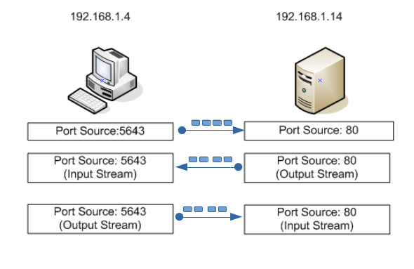
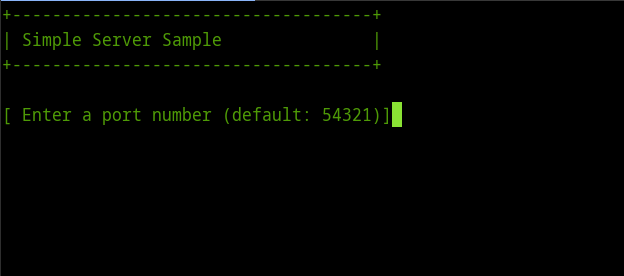
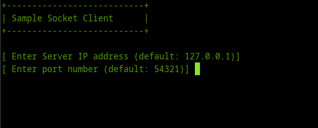

# Introduction to Sockets.

<b>The beginning of everything</b>

Socket is the name given to an abstraction through which an application may send and receive data. The term “Socket” refers to the Berkeley Sockets Interface, which was developed in 1978 for network programming with UNIX and was popularized by C programmers.

Because of the popularity of that abstraction, this term has been reused in many programming model including .NET technology.
The main types of sockets in TCP/IP today are: stream sockets and datagram sockets, both use TCP as the end-to-end protocol with IP underneath, the .NET framework provides a clear distinction between using TCP and UDP, defining a separate set of classes for both protocols.

<h3>Stream Sockets</H3>

Socket based communications in C# employ stream sockets, when processes communicate over a network .NET Framework technology uses the streams model to establish a connection between two o more processes. With stream sockets, a process (running program) establishes a connection to another process. 

A socket can hold two streams: one input stream and one output stream when the sender sends data to another process through the network by writing to the output stream associated with the socket, the receiver reads data written by the sender by reading from the input stream associated with the socket. While the connection is in place, data flows between the processes in continuous stream.

<h3>Addressing the connection</H3>

When you make a network connection, you need to know the address or the name of the remote machine, IPv4 uses 32 bit binary addresses to identify communicating hosts a client must specify the IP address of the host running the server program when it initiates the communication. 
In addition, a network connection requires a port number, after you connect to the proper host, you must identify a particular purpose for the connection. So, you can use a particular port number to communicate with the specific program.

<h3>Port Numbers</H3>

In TCP/IP port numbers are 16-bit numbers and the values range from 0-65535. In practice, port numbers below 1024 are reserved for predefined services, and you should not use them unless communicating with one of those services, client port numbers are allocated by the operating system to something not in use, while server port numbers are specified by the programmer, and are used to identify a particular service.
Both client and server must agree in advance on which port to use. If the port numbers used by the two parts of the system do not agree, communication does not occur.
Ports are divided into the following ranges:
<ul>
<li>0-1023: well-known ports</li>
<li>1024-49151: registered ports</li>
<li>49152-65535: dynamic or private ports</li>
</ul>

<b>Minimal TCP/IP Server</b>

The System.Net.Sockets.TcpListener class is used to create server applications. TcpListener provides a simple wrapper around the socket classes, here is a simple TCP Server that accepts a single client connection.

To compile this program using dotnet, type the following command at your command prompt:

<pre>
$ dotnet build
</pre>

And to run it, type this command line:

<pre>
$ dotnet run
</pre>

And you’ll see the following output on your screen:
 

<b>Fig 1: Result of running the SimpleTCPServer program.</b>
 

 

<b>Minimal TCP/IP Client</b>

The client is a simple console application, this application uses the <i>TcpClient</i> class to connect to the running server, and receives the returned message.

To compile this program using dotnet, type the following command at your command prompt:

<pre>
$ dotnet build
</pre>

And to run it, type this command line:

<pre>
$ dotnet run
</pre>

And you’ll see the following output on your screen:
 

<b>Fig 2: Result of running the SimpleTCPClient program.</b>
 

 
